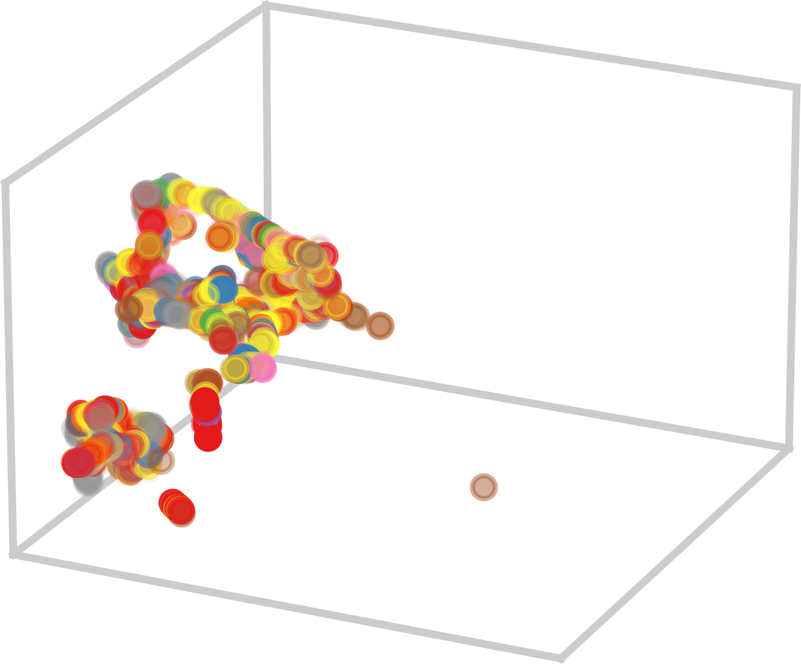

# Comprehensive benchmarking of Large Language Models for RNA secondary structure prediction

This repository contains the data and source code used for the "Comprehensive benchmarking of Large Language Models for RNA secondary structure prediction," by L.I. Zablocki, L.A. Bugnon, M. Gerard, L. Di Persia, G. Stegmayer, D.H. Milone. Briefings in Bioinformatics 2025 [[DOI](https://doi.org/10.1093/bib/bbaf137)], [[preprint](https://arxiv.org/abs/2410.16212)]. Research Institute for Signals, Systems and Computational Intelligence, [sinc(i)](https://sinc.unl.edu.ar).

In the last three years, a number of RNA large language models (RNA-LLM) have appeared in literature. We selected the models for benchmarking based on their open access availability, summarizing the main features in the table below.

| LLM         | Visualization | Dim | Pre-training seqs | Pre-training databases   | Architecture (number of layers) | Number of parameters | Source    |
|-------------|----------------------------------------------------------------------------------------------------|---------------------|-----------------------|------------|--------------------------------|----------------------|-------------------------------------------------|
| RNABERT 2022 [[1](https://academic.oup.com/nargab/article/4/1/lqac012/6534363)] |             | 120           | 70 k              | RNAcentral            | Transformer (6)       | 500 k              | [Link](https://github.com/mana438/RNABERT)       |
| RNA-FM 2022 [[2](https://arxiv.org/abs/2204.00300)]     |              | 640           | 23 M          | RNAcentral            | Transformer (12)      | 100 M          | [Link](https://github.com/ml4bio/RNA-FM)         |
| RNA-MSM 2024 [[3](https://academic.oup.com/nar/article/52/1/e3/7369930)]  |             | 768           | 3 M           | Rfam                   | Transformer (12)      | 96 M          | [Link](https://github.com/yikunpku/RNA-MSM)      |
| ERNIE-RNA 2024 [[4](https://www.biorxiv.org/content/10.1101/2024.03.17.585376v1)]  |         | 768           | 20 M          | RNAcentral            | Transformer (12)      | 86 M           | [Link](https://github.com/Bruce-ywj/ERNIE-RNA)    |
| RNAErnie 2024 [[5](https://www.nature.com/articles/s42256-024-00836-4)]  |           | 768           | 23 M         | RNAcentral            | Transformer (12)      | 105 M          | [Link](https://zenodo.org/records/10847621)      |
| RiNALMo 2024 [[6](https://arxiv.org/html/2403.00043v1)]    |             | 1280          | 36 M        | RNAcentral +Rfam +Ensembl | Transformer (33) | 650 M          | [Link](https://github.com/lbcb-sci/RiNALMo)       |

## Installation

These steps will guide you through the process of generating RNA embeddings with RNA-LLM models, and  training the secondary structure RNA predictor model, which uses RNA-LLM representations as input. 

First:
```
git clone https://github.com/sinc-lab/rna-llm-folding
cd rna-llm-folding
```
With a conda working installation, run:

```
conda env create -f environment.yml
```
This should install all required dependencies. Then, activate the environment with:

```
conda activate rna-llm-folding
```

## Reproduction of experiments
Scripts to train and evaluate a RNA-LLM-based  secondary structure predictor are in the `scripts` folder. 

For example, to use the _one-hot_ embedding for the _ArchiveII_ dataset, in the cross-family partitions, run:
```
python scripts/run_archiveII_famfold.py --emb one-hot_ArchiveII
```

The `--emb` option is used to tell the script the desired LLM and dataset combination that will be used for training and testing. In the example, we used the _one-hot_ embedding for _ArchiveII_, already available in `data/embeddings`. By default, train will be executed on GPU if available. Results will be saved in `results/<timestamp>/<dataset>/<llm>`.

To run the experiments with other datasets, use `scripts/run_bpRNA.py`, `scripts/run_bpRNA_new.py`, `scripts/run_pdb-rna.py` and `scripts/run_archiveII_kfold.py`, which are invoked the same way that’s described in the example. For more details on the benchmark method and data, check our manuscript.

To use other embeddings and datasets, download the RNA-LLM embedding representations for the desired LLM-dataset combination from the following table, and uncompress them in the `data/embeddings` directory. The files are in 7z format.


| ArchiveII   |  bpRNA & bpRNA-new | PDB-RNA |
|-----------|---------|---------|
| [one-hot](https://zenodo.org/api/records/13821093/files/one-hot_ArchiveII.7z/content) | [one-hot](https://zenodo.org/api/records/13821093/files/one-hot_bpRNA.7z/content)  | [one-hot](https://zenodo.org/api/records/13821093/files/one-hot_pdb-rna.7z/content) |
| [RNABERT](https://zenodo.org/api/records/13821093/files/rnabert_ArchiveII.7z/content)|  [RNABERT](https://zenodo.org/api/records/13821093/files/rnabert_bpRNA.7z/content)|   [RNABERT](https://zenodo.org/api/records/13821093/files/rnabert_pdb-rna.7z/content)|
| [RNA-FM](https://zenodo.org/api/records/13821093/files/rnafm_ArchiveII.7z/content)| [RNA-FM](https://zenodo.org/api/records/13821093/files/rnafm_bpRNA.7z/content)| [RNA-FM](https://zenodo.org/api/records/13821093/files/rnafm_pdb-rna.7z/content)|
| [RNA-MSM](https://zenodo.org/api/records/13821093/files/rna-msm_ArchiveII.7z/content)| [RNA-MSM](https://zenodo.org/api/records/13821093/files/rna-msm_bpRNA.7z/content)| [RNA-MSM](https://zenodo.org/api/records/13821093/files/rna-msm_pdb-rna.7z/content)|
| [ERNIE-RNA](https://zenodo.org/api/records/13821093/files/ERNIE-RNA_ArchiveII.7z/content)| [ERNIE-RNA](https://zenodo.org/api/records/13821093/files/ERNIE-RNA_bpRNA.7z/content)| [ERNIE-RNA](https://zenodo.org/api/records/13821093/files/ERNIE-RNA_pdb-rna.7z/content)|
| [RNAErnie](https://zenodo.org/api/records/13821093/files/RNAErnie_ArchiveII.7z/content)| [RNAErnie](https://zenodo.org/api/records/13821093/files/RNAErnie_bpRNA.7z/content)| [RNAErnie](https://zenodo.org/api/records/13821093/files/RNAErnie_pdb-rna.7z/content)|
| [RiNALMo](https://zenodo.org/api/records/13821093/files/RiNALMo_ArchiveII.7z/content)| [RiNALMo](https://zenodo.org/api/records/13821093/files/RiNALMo_bpRNA.7z/content)| [RiNALMo](https://zenodo.org/api/records/13821093/files/RiNALMo_pdb-rna.7z/content)|

Instructions to generate the RNA-LLM embeddings listed above, using the authors methods, are detailed in `scripts/embeddings`.

**HuggingFace demo**:
The benchmark can be run online with HuggingFace models and Colab in [this notebook](https://colab.research.google.com/github/sinc-lab/rna-llm-folding/blob/main/notebooks/demo_huggingface.ipynb).

## Comparison results

- **Projection of RNA-LLM embeddings**: The [UMAP notebook](https://colab.research.google.com/github/sinc-lab/rna-llm-folding/blob/main/notebooks/UMAP.ipynb) makes use of a UMAP projection to illustrate the high-dimensional embeddings into a 3D space.

- **Performance on increasing homology challenge datasets**: The [violinplots notebook](https://colab.research.google.com/github/sinc-lab/rna-llm-folding/blob/main/notebooks/violinplots.ipynb) generates the plots for performance analysis for each RNA-LLM with the different datasets.

- **Cross-family benchmarks**: We used the [boxplots notebook](https://colab.research.google.com/github/sinc-lab/rna-llm-folding/blob/main/notebooks/boxplots.ipynb) to assess inter-family performance.

- **Non-canonical and motifs performance**: [This notebook](https://colab.research.google.com/github/sinc-lab/rna-llm-folding/blob/main/notebooks/nc_motifs.ipynb) generates the comparison of non-canonical base pairs and the characterization of performance by structural motifs.
